After a certain period, bank customers may need to view, update, or revoke consents they have granted to API consumer 
applications to access account data. **Consent Manager** is an application in WSO2 Open Banking that supports all these
requirements and manages consents.

!!! tip
    You can use the [/admin endpoint in Consent REST API](../references/consent-rest-api.md#/Admin) 
    to retrieve consent details and customize Consent Manager. For example,

    ``` 
    curl -X GET "https://localhost:9446/api/fs/consent/admin/search?consentIDs=12345&clientIDs=5678&consentTypes=accounts&consentStatuses=authorized&userIDs=user1&fromTime=12012020&toTime=12012021&limit=10&offset=0" -H "accept: application/json" -H "Authorization Basic <TOKEN>>"
    ```

!!! note
    - Bank officers with the `CustomerCareOfficerRole` role and bank customers can access the Consent Manager.  
    - Customer Care Officers have privileges such as Advanced Search options and the ability to view the consents of all bank customers. 

## Configuring Consent Manager

1. Open the `<IS_HOME>/repository/deployment/server/webapps/consentmgr/runtime-config.js` file.

2. Follow the below instructions.

    - If the Consent Manager Portal is deployed on the WSO2 Identity Server, use the default configuration given below.
        ```
        window.env = {
            `USE_DEFAULT_CONFIGS: true,
            SERVER_URL: 'https://localhost:9446',
            SPEC: 'Default',
            TENANT_DOMAIN: 'carbon.super',
            NUMBER_OF_CONSENTS: 20,
            VERS`ION: '3.0.0'
        };
        ```

    -  If you are using a different server instance for the Identity Server, update the above configurations as follows.
        a. Set the USE_DEFAULT_CONFIGS parameter to false.
        b. Update the SERVER_URL parameter with the URL of the Identity Server.

3. Open the `<IS_HOME>/repository/conf/deployment.toml` file and update the configurations.

    | Configuration              | Description |
    | -------------------------- | ----------- |
    | client_id                  | The Consumer Key of the application created. |
    | client_secret              | The Consumer Secret of the application created. |
    | identity_server_base_url   | The hostname of the Identity Server. |
    | application_name_param     | This is the parameter name to extract the consumer application name to display in the consent manager portal. The value should be stored during application creation to retrieve here.|
    | application_logo_uri_param | This is the parameter name to extract the consumer application logo to display in the consent manager portal. The value should be stored during application creation to retrieve here. |

    For example,
    ```
    [financial_services.consent.portal.client_credentials]
    client_id="2zB5s9wGHWVwmlrvHdWa6Mwc4vsa"
    client_secret="cqblprasAniVfi02IXGFvp8VREAa"

    [financial_services.consent.portal.params]
    identity_server_base_url="https://localhost:9446"
    application_name_param="client_name"
    application_logo_uri_param="software_logo_uri"
    ```
    
## Setting up Consent manager app

### Create API Resource

1. Go to IS admin console `https://<IS_HOST>:9446/console`

2. Log into the IS admin console using IS admin credentials.

3. Go to the **Api Resources** tab in the left pane.

4. Create a new API Resource. Eg: consent-manager-resource

5. Fill Identifier and Display Names. <br/> 


6. Click the Next button.

7. Add the scopes **consents:read_self** and **consents:read_all** one by one. Enter scope and Display name as below.<br/> 


6. Click the Next button.

8. Scopes will be displayed as below once you add all the scopes. <br/> 
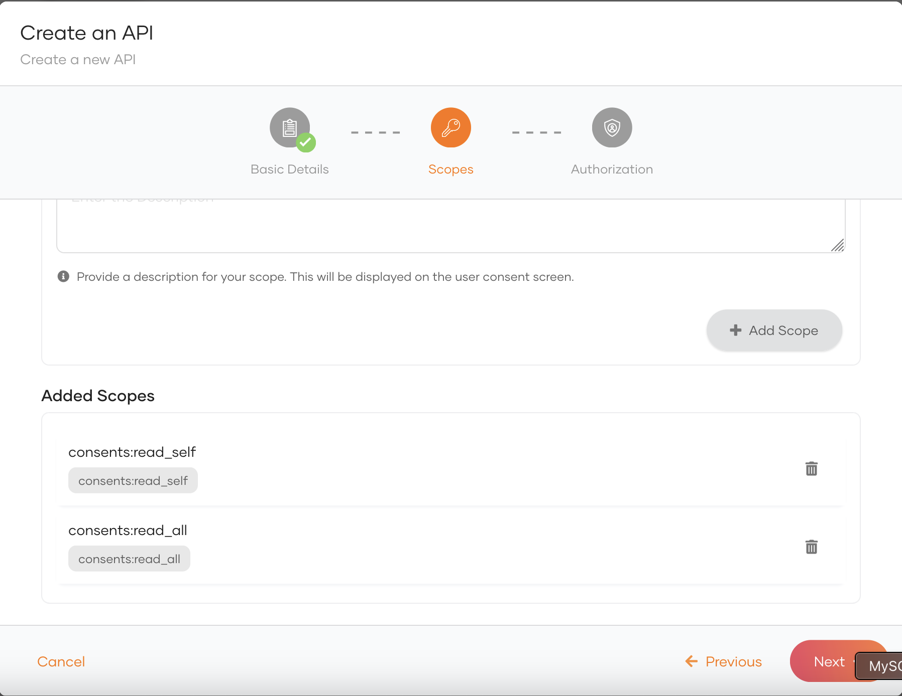

9. Click the **Next** button and Click on **Create** button.

### Configure Users and Roles

#### Add CustomerCareOfficerRole Role

CustomerCareOfficerRole is required for bank users to log into the Consent Manager Portal and search for the consents granted by any user.

1. Go to **Roles** under the **User Management** tab in the left pane.

2. Click on **+ New Role**.<br/> 
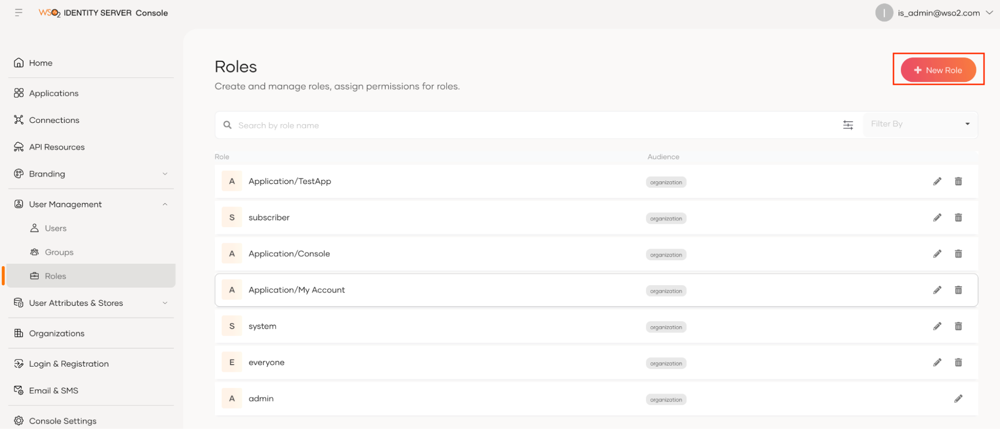

3. Enter following details and click on Next button.
    - Role Name: CustomerCareOfficerRole
    - Role audience: Organization<br/> 
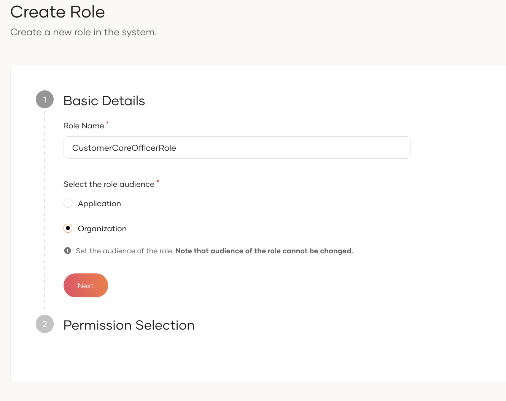

4. Select the created **API Resource** under the **Permission Selection** section.

5. Add the **consents:read_all** permission from the API resource separately.<br/> 
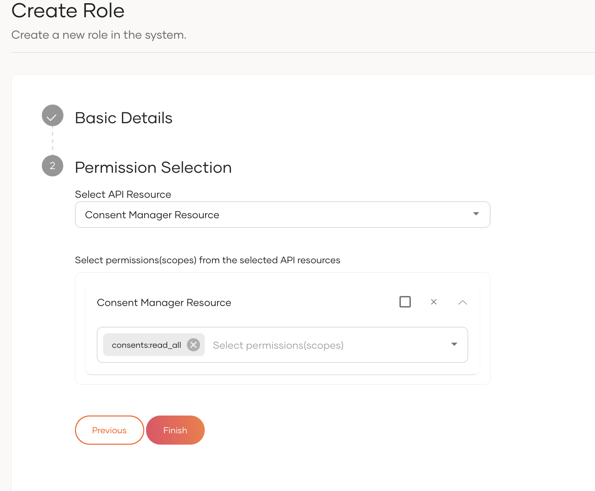

6. Click on the **Finish** button.

#### Add ConsentPortalRole Role

ConsentPortalRole is required for users to log into the Consent Manager Portal and search for the consents granted by them.

Similarly create another role named as **ConsentPortalRole** and assign **consents:read_self** scope to the role.

#### Add New User

1. Go to **Users** under the **User Management** tab in the left pane.<br/> 
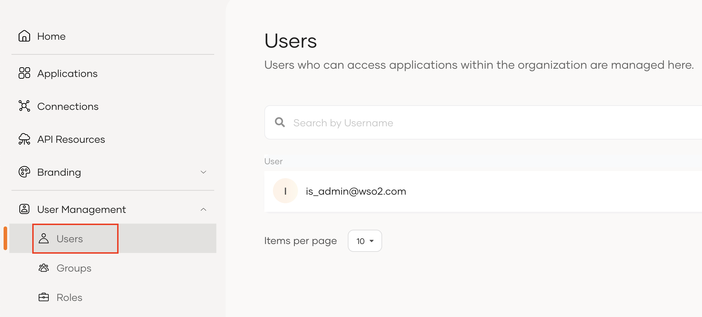

2. Click on **Add User** → **Single User**.

3. Create the user by providing necessary details.<br/> 
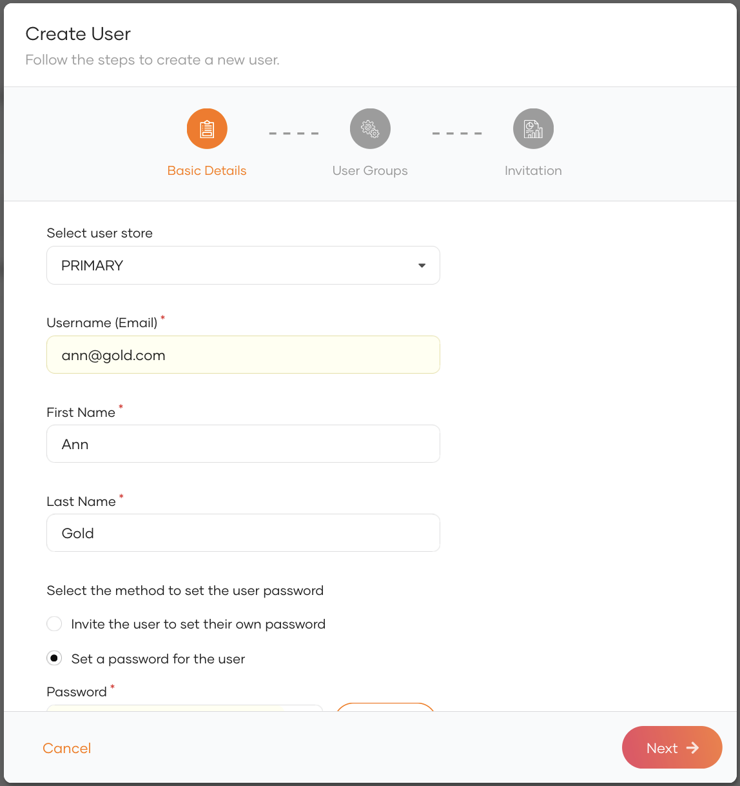

4. Click on the Next button.

!!! note
    Select the admin group, If you want to add the user to the admin group. Otherwise proceed the step without selecting the admin group.

5. Then click on the Close button.

6. Go to the **Roles** under the **User Management** tab in the left pane.

7. Select **CustomerCareOfficerRole** role.

8. Go to **Users** tab and assign the created user to the **CustomerCareOfficerRole** role.

Similarly assign the **ConsentPortalRole** to the users who have a consumer role.

### Create an Application

1. Go to IS admin console `https://<IS_HOST>:9446/console`

2. Log into the IS admin console using IS admin credentials.

3. Go to **Applications** from the left sidebar.<br/> 
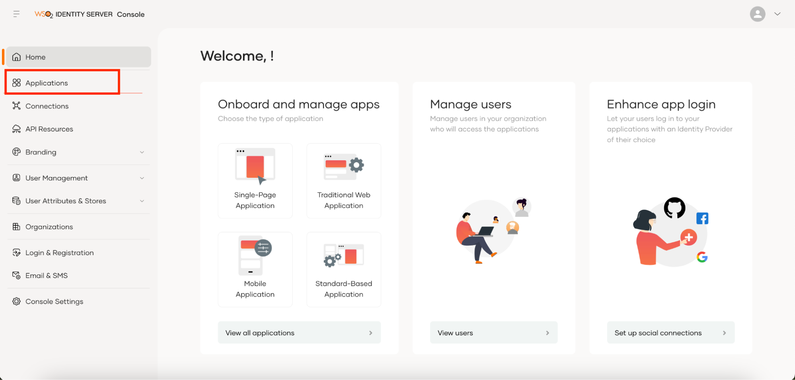

4. Click on  **+ New Application**.<br/> 


5. Select Standard Base Application.<br/> 


6. Create an application providing the following details.<br/> 
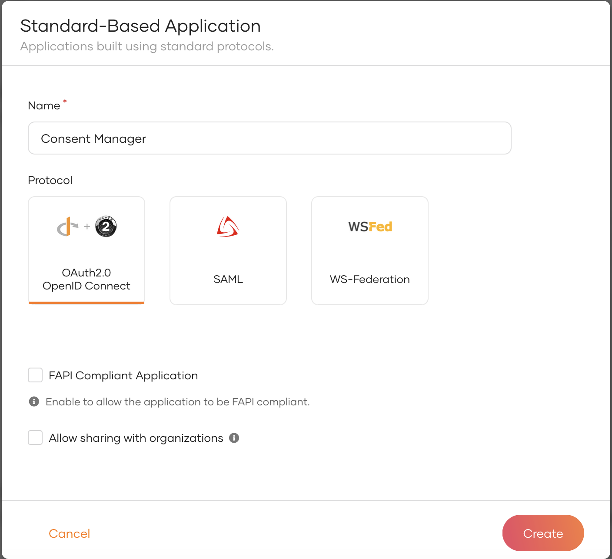

7. Click **Create**, and the service provider will be created.

8. Once the application is created, do the following modifications to the application **Protocol** tab.
    - Configure the below details under the **OAuth2.0/OpenID Connect** section. 
    | Section | Configuration | Value |
    | ------- | ------------- | ----- |
    | OAuth2.0/OpenID | Allowed grant types | Select code, refresh token |
    | Authorized redirect URLs | Add a redirect url | Value should be `https://<IS_HOST>:9446/consentmgr/scp_oauth2_callback` |
    | Access Token | Token type | JWT |
    | Access Token | Token binding type | None |
    | Certificate | Type | None |

9. Then goto the **Advance** tab. Un- tick **Skip Login Consent** and click update.<br/> 
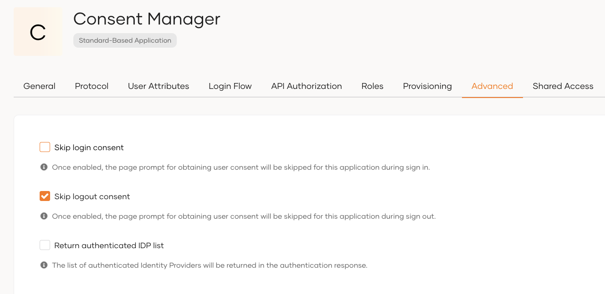

10. Go to the **Roles** tab and select **Organization** as the **Role Audience**.<br/> 
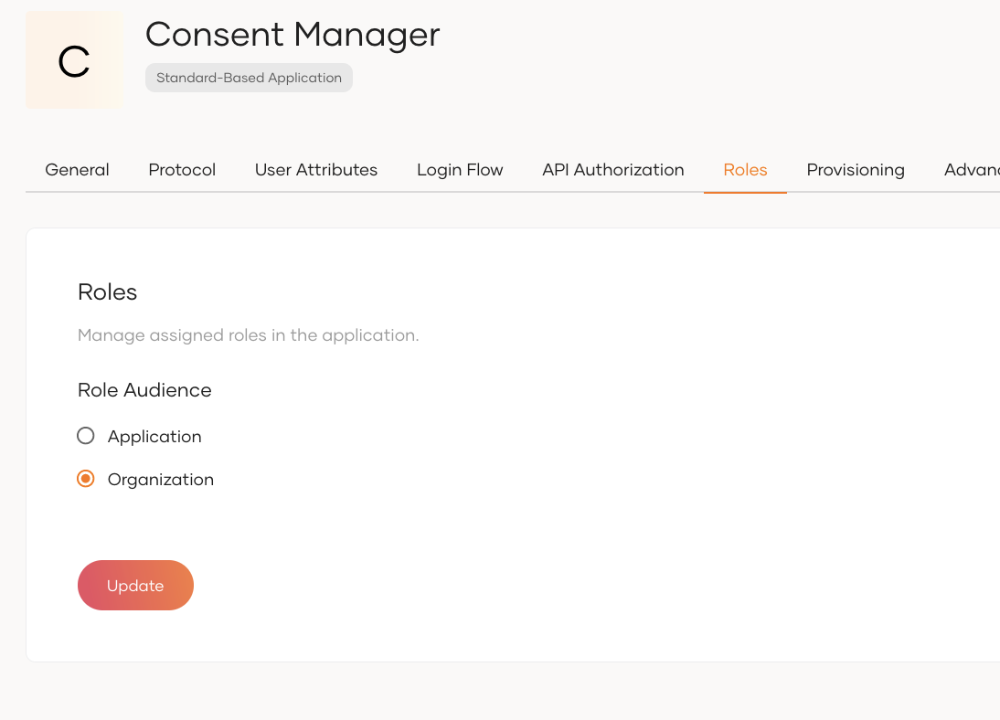

11. Click on **Update** Button.

12. Go to the **API Authorization** tab.

13. Click on the **Authorize an API Resource** button.<br/> 
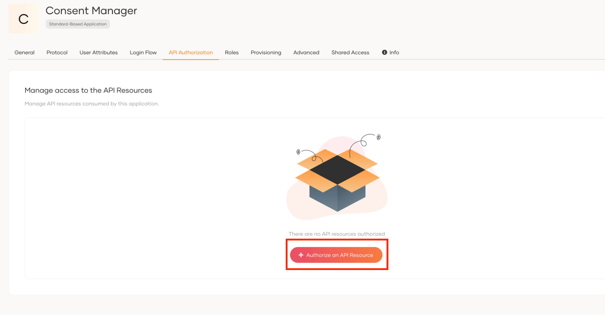

14. Select the API resource created in [earlier](../learn/consent-manager.md#create-api-resource) from the API Resource drop down.

15. Add **consents:read_self** and **consents:read_all** scopes to the Authorized Scopes.<br/> 
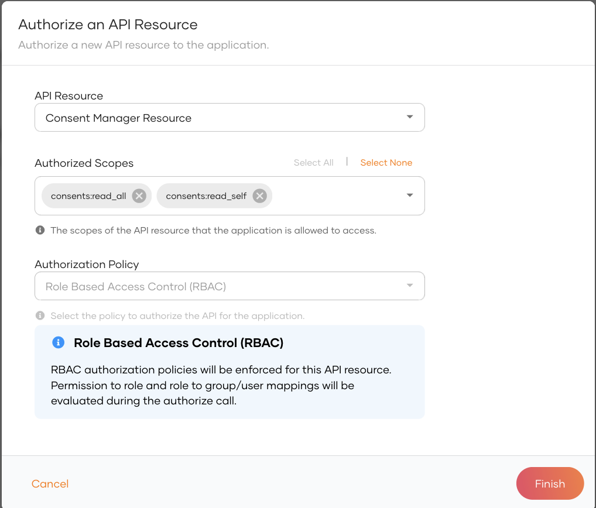

16. Click on **Finish** Button.

17. Go to the **User Attributes** tab under the application.<br/> 
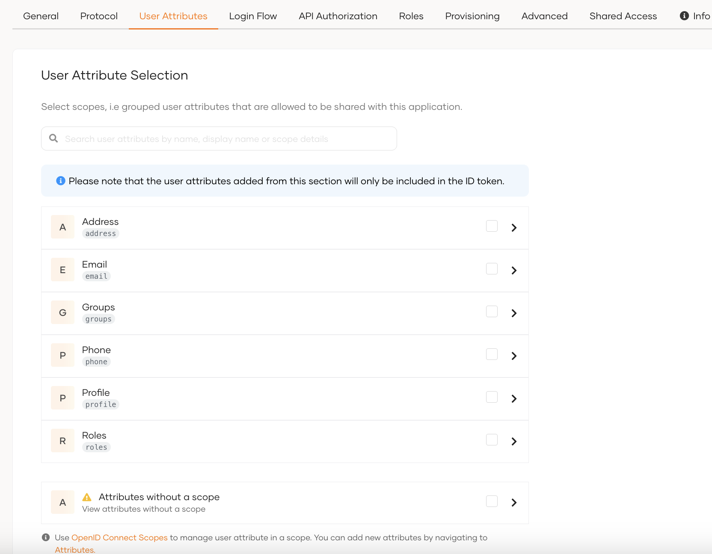

18. Expand the **Profile** attribute and tick the **Username** attribute under it as a Requested attribute.<br/> 
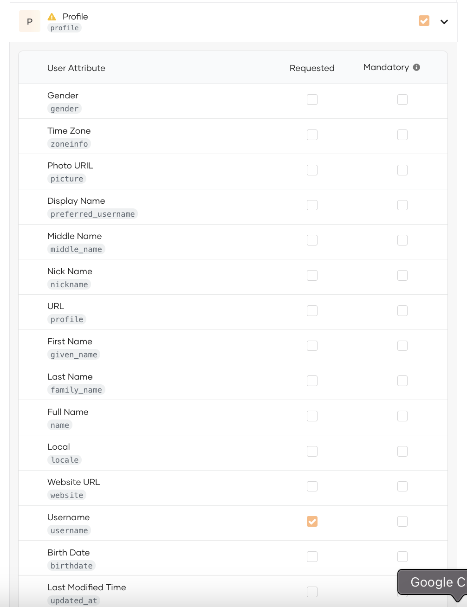

19. Go to **Subject** section and tick on **Assign alternate subject identifier**.<br/> 


20. Select the **Username** as the **Subject** attribute.<br/> 
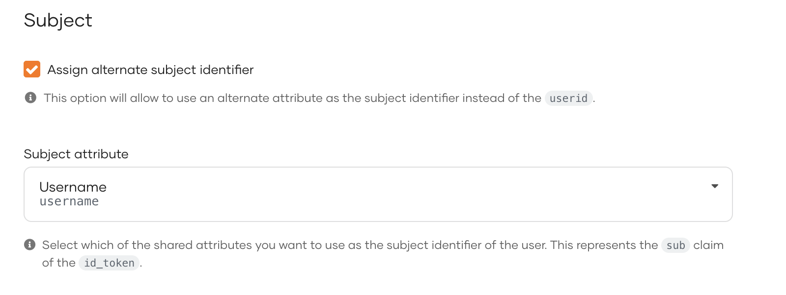

21. Click **Update**.

## Using Consent Manager

1. Go to the Consent Manager application at `https://<IS_HOST>:9446/consentmgr`.

2. Sign in with the credentials of the users created in [Create Users](../learn/consent-manager.md#add-new-user) section.

3. The **consentmgr** application requests access to your profile. To grant access, click **Continue**.<br/> 


4. You are redirected to the homepage of the Consent Manager portal.


The three tabs are as follows:

   - **Active**: Lists active consents that can access your account/payment information.
   - **Expired**: Lists expired consent that cannot access your account/payment information anymore.
   - **Withdrawn**: Lists the consents that you have revoked.

!!! tip
    Use the **Search** button to search consents.

### Viewing consent details

- To view consent details, click the respective `Action` button. 

    

- You can view the details such as the associated API consumer application, consent granted date, consent expiry date, 
account numbers, and permissions that you have granted.

    

### Revoking a consent

- To revoke a consent, review the details and click **Stop Sharing**. 
    
    
    
- Revoking a consent consists of 2 steps:

    - Step 1: The first step shows the impact of withdrawing the consent.
    
        
    
    - Step 2: Displays the information the consent has access to. 
    
        
    
- Once you click **Stop Sharing**, the status of the consent changes to `withdrawn`. You can find this consent in the 
**Withdrawn** tab now.

<!-- !!!note
    To learn about customizing the Consent Manager Portal, see the [Customize the Consent Manager Portal](../develop/customize-consent-manager-portal.md) documentation. -->